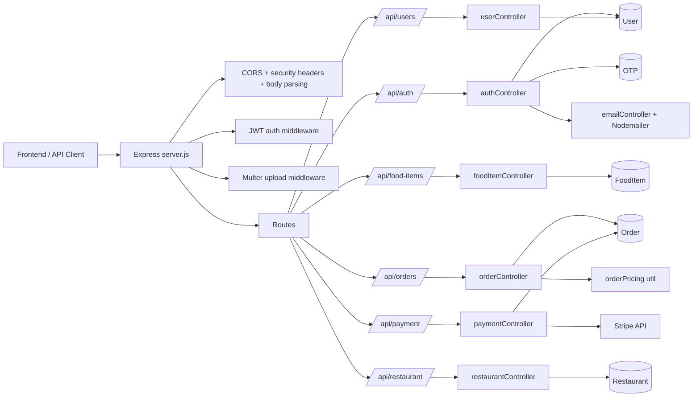

# Backend Revision Guide

This document is a full revision note for the backend of the food ordering system. It covers the architecture, folder structure, request flow, database models, endpoints, and the important implementation details that matter when revisiting the codebase after a long break.

## 1. What This Backend Does

This backend is an Express + MongoDB API for a food ordering system. It supports:

- User registration and login with JWT
- OTP-based email verification and password reset
- Food item CRUD and category listing
- Order creation, order listing, order status updates, and dashboard stats
- Stripe payment intent creation and payment confirmation
- Restaurant profile management
- User profile update and password change
- Image uploads for food items, restaurant logo, and user avatars
- Demo data seeding for local development

The backend is built around a simple architecture:

- Route files define URLs and middleware.
- Controllers contain business logic.
- Models define MongoDB schema structure.
- Middleware handles authentication, authorization, uploads, security headers, and rate limiting.
- Utility functions handle shared calculations, especially order pricing.

## 2. Main Entry Point

The main server file is `backend/server.js`.

It does the following:

- Loads environment variables with `dotenv`
- Connects to MongoDB through `backend/config/db.js`
- Applies security headers
- Configures CORS
- Parses JSON and URL-encoded request bodies
- Serves uploaded files from `/uploads`
- Mounts all API route groups
- Provides a health check route
- Provides an admin-only demo initialization route
- Defines global error handling and a 404 handler

### Boot Sequence

1. Load environment variables.
2. Create the Express app.
3. Apply security middleware.
4. Configure CORS.
5. Enable body parsing.
6. Expose static uploads.
7. Connect to MongoDB.
8. Mount routes.
9. Add health and demo routes.
10. Add error and 404 handlers.
11. Start listening on `PORT` or `5000`.

## 3. Folder Structure

### Backend Folders

- `backend/config/`
- `backend/controllers/`
- `backend/middleware/`
- `backend/models/`
- `backend/routes/`
- `backend/scripts/`
- `backend/test/`
- `backend/utils/`

### Responsibilities

- `config/`: database connection setup
- `controllers/`: request handlers and business logic
- `middleware/`: JWT auth, role authorization, security headers, rate limiting, uploads
- `models/`: Mongoose schemas
- `routes/`: endpoint definitions
- `scripts/`: demo seed script
- `test/`: pricing tests
- `utils/`: shared helper logic

## 4. System Architecture

## 5. Data Model Overview

### User

File: `backend/models/User.js`

Fields:

- `fullname`
- `email`
- `password`
- `role` (`user`, `seller`, `admin`)
- `phone`
- `address`
- `avatar`
- `emailVerified`
- `verificationToken`
- `verificationExpires`

Important behavior:

- Password is stored hashed using bcrypt.
- `toJSON()` removes password before returning user objects.

### OTP

File: `backend/models/OTP.js`

Fields:

- `email`
- `otp`
- `type` (`password_reset`, `email_verification`)
- `expiresAt`
- `attempts`
- `used`

Important behavior:

- OTP records expire automatically with a TTL index.
- OTPs are invalidated when new OTPs are issued for the same email and type.

### FoodItem

File: `backend/models/FoodItem.js`

Fields:

- `name`
- `description`
- `price`
- `category`
- `isAvailable`
- `image`
- `ingredients`
- `popular`

Important behavior:

- Text index on `name` and `description`
- Indexes on `category` and `isAvailable`

### Order

File: `backend/models/Order.js`

Fields:

- `orderNumber`
- `user`
- `items`
- `total`
- `status`
- `customerName`
- `customerPhone`
- `deliveryAddress`
- `specialInstructions`
- `estimatedDelivery`
- `notified`
- `payment`
- `statusHistory`

Important behavior:

- Generates a unique order number before save.
- Automatically adds the first status history entry.
- Keeps payment subdocument with Stripe details.
- Has indexes for user orders, status, and Stripe payment intent ID.

### Restaurant

File: `backend/models/Restaurant.js`

Fields:

- `name`
- `phone`
- `email`
- `address`
- `openingHours`
- `description`
- `logo`
- `socialMedia`

Important behavior:

- This model is intended to behave like a singleton document.
- `getRestaurant()` creates a default restaurant profile if one does not exist.

## 6. Authentication and Authorization

File: `backend/middleware/auth.js`

### `auth` middleware

- Reads the `Authorization` header.
- Expects `Bearer <token>`.
- Verifies the JWT using `JWT_SECRET`.
- Loads the user from MongoDB.
- Attaches the user to `req.user`.

### `authorize(...roles)` middleware

- Ensures the current user role is one of the allowed roles.
- Used for admin and seller-only operations.

### Role structure

- `user`: normal customer
- `seller`: can manage orders and dashboard data
- `admin`: full access to admin routes

## 7. Security and Upload Middleware

### Security headers and rate limiting

File: `backend/middleware/security.js`

It provides:

- `securityHeaders`
- `rateLimit`

Security headers set:

- `X-Content-Type-Options: nosniff`
- `X-Frame-Options: DENY`
- `Referrer-Policy: strict-origin-when-cross-origin`
- `Permissions-Policy: camera=(), microphone=(), geolocation=()`

Rate limiting is in-memory and keyed by IP + route.

### Upload handling

File: `backend/middleware/upload.js`

- Uses Multer disk storage.
- Saves files under `backend/uploads`.
- Creates the folder if it does not exist.
- Accepts only image files.
- Enforces a 5 MB size limit.

Uploads are used for:

- Food item images
- Restaurant logo
- User avatar

## 8. Route Groups and Endpoints

## 8.1 Auth Routes

File: `backend/routes/auth.js`

Base path: `/api/auth`

### Endpoints

- `POST /register`
- `POST /login`
- `GET /me`
- `POST /forgot-password`
- `POST /verify-otp`
- `POST /reset-password`
- `POST /resend-otp`
- `POST /verify-email`
- `POST /resend-verification`

### Behavior

- `register` is OTP-based if no OTP is sent.
- `login` returns a JWT token.
- `me` returns the authenticated user.
- OTP routes are rate-limited.

### Flow

1. User submits email and password.
2. If OTP is not included, server sends OTP to email.
3. User submits OTP to complete registration.
4. Server hashes password, saves user, and returns token.

## 8.2 Food Item Routes

File: `backend/routes/foodItems.js`

Base path: `/api/food-items`

### Endpoints

- `GET /`
- `GET /data/categories`
- `GET /:id`
- `POST /`
- `PUT /:id`
- `DELETE /:id`

### Access

- Public read endpoints:
  - `GET /`
  - `GET /data/categories`
  - `GET /:id`
- Admin-only write endpoints:
  - `POST /`
  - `PUT /:id`
  - `DELETE /:id`

### Behavior

- Supports filtering by category, search text, availability, page, and limit.
- Converts price to a number on create/update.
- Supports image upload using Multer.

## 8.3 Order Routes

File: `backend/routes/orders.js`

Base path: `/api/orders`

### Endpoints

- `GET /`
- `GET /stats/overview`
- `GET /:id`
- `POST /`
- `PATCH /:id/status`

### Access

- All endpoints require authentication.
- `GET /stats/overview` requires `admin` or `seller`.
- `PATCH /:id/status` requires `seller` or `admin`.

### Behavior

- Users can only see their own orders.
- Sellers/admins can see all orders.
- Order creation recalculates prices on the server.
- Status transitions are restricted.

### Allowed status transitions

- `pending` -> `accepted` or `cancelled`
- `accepted` -> `preparing` or `cancelled`
- `preparing` -> `ready` or `cancelled`
- `ready` -> `completed` or `cancelled`
- `completed` -> none
- `cancelled` -> none

## 8.4 Payment Routes

File: `backend/routes/payment.js`

Base path: `/api/payment`

### Endpoints

- `POST /create-payment-intent`
- `POST /confirm-payment`
- `GET /status`

### Access

- `create-payment-intent`: authenticated
- `confirm-payment`: authenticated
- `status`: public

### Behavior

- Uses Stripe.
- Recalculates pricing from DB before payment intent creation.
- Confirms the payment belongs to the logged-in user.
- Prevents duplicate order creation for the same Stripe intent.

## 8.5 Restaurant Routes

File: `backend/routes/restaurant.js`

Base path: `/api/restaurant`

### Endpoints

- `GET /`
- `PUT /`

### Access

- `GET /`: public
- `PUT /`: admin only

### Behavior

- Returns or updates the single restaurant profile.
- Supports logo upload.

## 8.6 User Routes

File: `backend/routes/users.js`

Base path: `/api/users`

### Endpoints

- `GET /profile`
- `PUT /profile`
- `PUT /change-password`

### Access

- All require authentication.

### Behavior

- `GET /profile` returns current profile data.
- `PUT /profile` updates name, phone, address, and avatar.
- `PUT /change-password` verifies current password and stores a new hashed password.

## 9. Controller Logic

## 9.1 Auth Controller

File: `backend/controllers/authController.js`

### `register`

Two-step registration:

- If no OTP is provided:
  - generate OTP
  - store OTP in MongoDB
  - email OTP
  - return response saying OTP is required
- If OTP is provided:
  - verify OTP
  - hash password
  - create user
  - mark email as verified
  - return JWT token and user data

### `login`

- Finds user by email
- Optionally validates requested role
- Compares password with bcrypt
- Returns JWT token and user info

### `getMe`

- Returns `req.user`

### Password reset flow

- `forgotPassword`: send OTP
- `verifyOTP`: validate OTP
- `resetPassword`: verify OTP, update password, mark OTP used
- `resendOTP`: resend password-reset OTP

### Email verification flow

- `verifyEmail`: verify email OTP and set `emailVerified = true`
- `resendVerification`: resend verification OTP

## 9.2 Food Item Controller

File: `backend/controllers/foodItemController.js`

### `getFoodItems`

Supports query params:

- `category`
- `search`
- `available`
- `page`
- `limit`

### `getFoodItemById`

- Returns a single food item by ID
- Handles invalid ObjectId and not-found cases

### `createFoodItem`

- Reads request body
- Attaches uploaded image path if present
- Converts price to number
- Saves to MongoDB

### `updateFoodItem`

- Updates existing food item
- Can replace image
- Runs schema validation

### `deleteFoodItem`

- Deletes food item by ID

### `getCategories`

- Returns unique food categories

## 9.3 Order Controller

File: `backend/controllers/orderController.js`

### `getOrders`

- Users only see their own orders
- Admins/sellers can see all orders
- Supports status filter and pagination

### `getOrderById`

- Users can only access their own order
- Admin/seller can access any order

### `createOrder`

- Reads items and customer info from request body
- Recalculates prices using `priceOrderItems()`
- Creates and saves order
- Populates food item references before returning

### `updateOrderStatus`

- Validates the new status
- Checks allowed transition from current status
- Updates status and status history

### `getOrderStats`

Returns:

- total orders
- completed orders
- pending orders
- active orders
- today's orders
- total revenue from completed orders

## 9.4 Payment Controller

File: `backend/controllers/paymentController.js`

### `createPaymentIntent`

- Recalculates order total from database prices
- Creates Stripe PaymentIntent in INR
- Stores `userId` in metadata
- Returns `clientSecret` and payment intent ID

### `confirmPayment`

- Validates request payload
- Retrieves Stripe payment intent
- Confirms status is succeeded
- Confirms payment belongs to the current user
- Recalculates current order total again
- Checks the Stripe amount matches the current order total
- Prevents duplicate confirmation if order already exists
- Creates and saves the Order

### `getPaymentStatus`

- Returns basic Stripe configuration status

## 9.5 Restaurant Controller

File: `backend/controllers/restaurantController.js`

### `getRestaurant`

- Returns the singleton restaurant record
- Creates a default record if missing

### `updateRestaurant`

- Updates restaurant fields
- Saves logo path if uploaded
- Uses upsert so a record is always present

## 9.6 User Controller

File: `backend/controllers/userController.js`

### `getProfile`

- Returns current authenticated user

### `updateProfile`

- Updates fullname, phone, address
- Stores avatar if uploaded

### `changePassword`

- Requires current and new password
- Verifies current password with bcrypt
- Stores new hashed password

## 9.7 Email Controller

File: `backend/controllers/emailController.js`

This handles OTP generation and delivery.

### Main functions

- `generateOTP()`
- `sendOTP(email, otp, type)`
- `storeOTP(email, otp, type)`
- `verifyOTP(email, otp, type)`
- `cleanupExpiredOTPs()`

### Behavior

- Uses Nodemailer with Gmail SMTP.
- Invalidates previous unused OTPs before saving a new one.
- OTPs expire after 10 minutes.
- OTP verification checks email, code, type, and expiration.

## 10. Shared Utility: Order Pricing

File: `backend/utils/orderPricing.js`

This is one of the most important backend files.

### Purpose

It ensures the backend, not the frontend, determines the final order price.

### Rules

- Order must contain at least one item
- Quantity must be an integer from 1 to 50
- Each item must include a food item ID
- Each food item is fetched from MongoDB
- Food item must exist and be available
- Minimum order amount is ₹50

### Output

It returns:

- `items`: normalized item snapshots
- `totalPaise`: total in paise
- `total`: total in rupees

### Why it matters

This prevents clients from tampering with price values.

## 11. Demo Seed Script

File: `backend/scripts/initDemo.js`

### What it does

- Connects to MongoDB
- Clears existing users, food items, and orders
- Creates demo users
- Creates demo food items
- Creates default restaurant profile
- Creates a couple of sample orders
- Closes the DB connection

### Usage

- Triggered by `POST /api/init-demo`
- Protected by `auth` + `authorize('admin')`

## 12. Test Files and Helpers

### Pricing test

File: `backend/test/orderPricing.test.js`

This tests:

- authoritative pricing from DB values
- invalid quantities
- unavailable items

### Stripe helpers

Files:

- `backend/test-stripe.js`
- `backend/debug-payment.js`

These are local helper scripts for Stripe debugging and are not part of the normal API route flow.

## 13. External Dependencies

From `backend/package.json`:

- `express`
- `mongoose`
- `jsonwebtoken`
- `bcryptjs`
- `cors`
- `dotenv`
- `multer`
- `nodemailer`
- `stripe`
- `razorpay`

Important note:

- Stripe is actually wired into the payment controller.
- Razorpay is installed but not used in the active route flow.

## 14. End-to-End Flows

## Registration Flow

1. Client calls `POST /api/auth/register`.
2. If OTP is missing, backend sends OTP.
3. Client submits OTP.
4. Backend verifies OTP and creates user.
5. JWT token is returned.

## Login Flow

1. Client calls `POST /api/auth/login`.
2. Backend checks email and password.
3. Backend optionally checks role.
4. JWT token is returned.

## Password Reset Flow

1. Client calls `POST /api/auth/forgot-password`.
2. OTP is emailed.
3. Client calls `POST /api/auth/verify-otp`.
4. Client calls `POST /api/auth/reset-password`.
5. Password is updated.

## Food Ordering Flow

1. Client sends cart items.
2. Backend fetches current FoodItem records.
3. Backend recalculates prices.
4. Backend validates availability and minimum amount.
5. Order is created.

## Stripe Payment Flow

1. Client sends order items to `POST /api/payment/create-payment-intent`.
2. Backend recalculates total and creates Stripe PaymentIntent.
3. Client completes payment in Stripe.
4. Client sends `paymentIntentId` and order data to `POST /api/payment/confirm-payment`.
5. Backend verifies the payment and creates the order.

## Order Status Flow

1. Order starts as `pending`.
2. Seller/admin changes it through permitted transitions.
3. Each change is appended to `statusHistory`.
4. Final states are `completed` or `cancelled`.

## 15. Important Revision Notes

These are the things most likely to be forgotten:

- Orders are price-checked on the server.
- Users can only read their own orders.
- Status changes are limited by transition rules.
- OTP is reused for two different flows.
- Restaurant is a singleton document.
- Uploaded images are stored locally and served statically.
- Stripe confirmation checks both payment status and ownership.
- Payment and direct order creation both use the same pricing utility.
- Auth routes are rate-limited.
- The backend defaults to local MongoDB if no URI is provided.

## 16. Quick Endpoint Map

### Public

- `GET /api/health`
- `GET /api/restaurant`
- `GET /api/food-items`
- `GET /api/food-items/data/categories`
- `GET /api/food-items/:id`
- `GET /api/payment/status`

### Auth Required

- `GET /api/auth/me`
- `GET /api/orders`
- `GET /api/orders/:id`
- `POST /api/orders`
- `POST /api/payment/create-payment-intent`
- `POST /api/payment/confirm-payment`
- `GET /api/users/profile`
- `PUT /api/users/profile`
- `PUT /api/users/change-password`

### Admin Only

- `POST /api/food-items`
- `PUT /api/food-items/:id`
- `DELETE /api/food-items/:id`
- `PUT /api/restaurant`
- `POST /api/init-demo`

### Seller/Admin

- `GET /api/orders/stats/overview`
- `PATCH /api/orders/:id/status`

## 17. Suggested Revision Order

If you are revising the backend after a long gap, study it in this order:

1. `backend/server.js`
2. `backend/middleware/auth.js`
3. `backend/models/User.js`
4. `backend/models/FoodItem.js`
5. `backend/models/Order.js`
6. `backend/utils/orderPricing.js`
7. `backend/controllers/authController.js`
8. `backend/controllers/orderController.js`
9. `backend/controllers/paymentController.js`
10. `backend/controllers/foodItemController.js`
11. `backend/controllers/userController.js`
12. `backend/controllers/restaurantController.js`
13. `backend/controllers/emailController.js`
14. `backend/scripts/initDemo.js`

## 18. Final Mental Model

Think of the backend as four layers:

- **HTTP layer**: route files
- **Policy layer**: auth, roles, rate limit, upload rules
- **Business layer**: controllers and pricing utility
- **Data layer**: Mongoose models and MongoDB

The most important design principle in this backend is that the server is authoritative. The frontend can request an order, but the backend decides the real price, the real status transitions, the real authentication state, and the final payment confirmation.
